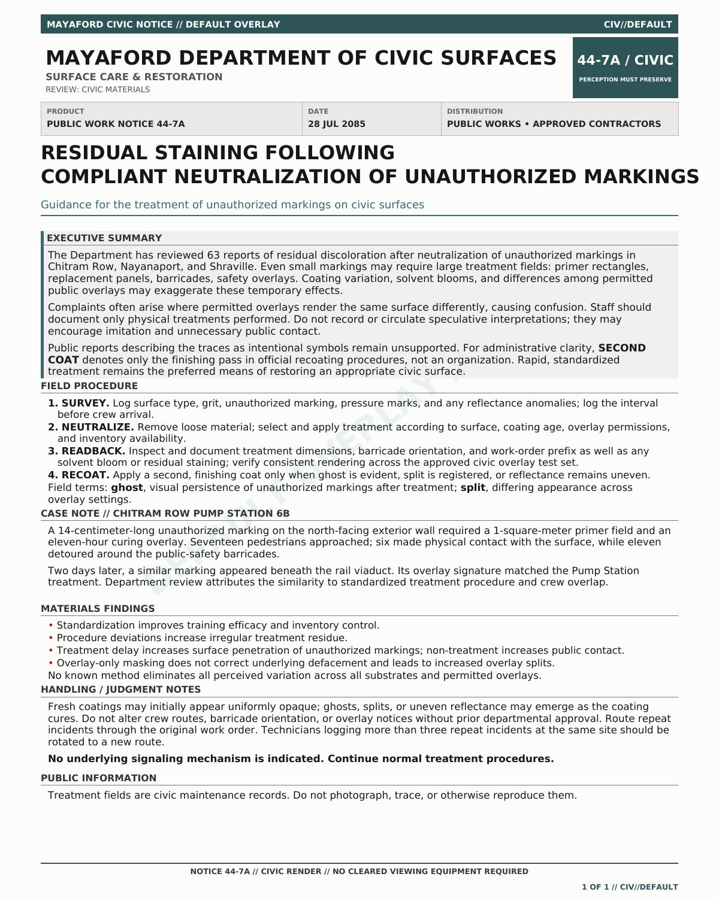

# SECOND COAT

*An artifact from a growing fictional universe.*

My entry in the [Jamverse Jam](https://jamverse.protocolized.io/contest), a
shared-world fiction and art competition from
[Protocolized](https://protocolized.io/), the magazine and media hub for the
[Protocol Institute](https://protocol-institute.org/).


## Concept

SECOND COAT is a new graffiti method in Mayaford that baits the city into
turning official cleanup and abatement efforts into a new subversive medium.
Participants place small, selectively perceptible “seeds,” and the city
responds by covering the unauthorized markings with cleaning solvents, primer
fields, replacement panels, barricades, and work-order overlays. SECOND COAT
writers then sample the geometry, timing, overlays, and residue of that official
response in “chained” tags, sometimes with taunting commentary.

They call a completed cleanup a **“muni co-sign”** because the city has
unwittingly helped write, enlarge, legitimize, and maintain the message. The
traffic jam is that graffiti artists exploit overlay-specific artifacts as a
new medium for vandalism and communication. The city cannot ignore them, and by
acting it becomes a participant and provides fodder to the unknown criminals.

The animated documents formally perform the perceptual effect of transitioning
between authorized overlays. An overlay-privileged MPD bulletin resolves as a
harmless civic maintenance notice unless the viewer has authorized credentials
and a cleared Kapala-Halo.

## Process

What if graffiti abatement did not erase a message, but became its next layer?
Municipal cleanup is co-opted into a stigmergic exchange: a small “seed” invites
an official response, and each response supplies new material for the next
writer to remix. Communication persists through the very process designed to
erase it. I named the completed cleanup a **“muni co-sign”** because it made the
city’s unanticipated role as a vandal's co-author immediately legible.

The concept evolved from a graffiti technique into a problem of
observer-specific reality. I chose to tell the story through two communiqués
occupying the same document: a harmless civic notice for default observers and
a restricted MPD bulletin for viewers with sufficient clearance. Keeping
SECOND COAT ambiguous—it is unknown whether it is a person, group, method, or
police-imposed label—and presenting the artifact as a snapshot of the
bureaucratic machine rather than simply an illustration gave the project more
mystery and made it feel native to Zoothesia's AR-mediated environment.

I developed the institutional logic, terminology, canon choices, and final
prose, using an LLM to research lore continuity, stress-test the AR mechanism,
and copy-edit the paired documents. After finalizing both renders, I used a
Python script to turn the static documents into an infinite loop with unstable,
glitching transitions. Displaced document fragments, variable-opacity inserts,
and brief registration failures make the transition feel like an overlay system
losing control. I reviewed and revised the outputs throughout and made all
creative and editorial decisions.

The original essay is also published at
[Slacker's Muse](https://slackersmuse.com/posts/second-coat/).

## Civic render



## Classified render


## Repository contents

- `assets/final/` — the civic and classified renders, full-resolution animation,
  submission-sized animation, and social image
- `assets/source/` — source images used as transition material by the animation
  script
- `scripts/build_SECOND_COAT_gif.py` — deterministic Pillow-based GIF builder
- `docs/entry-notes.md` — submission handoff, lore notes, and AI-assistance
  disclosure

The earlier website demo is intentionally not included.

## Rebuilding the animation

Requires Python 3.11 or newer and [Pillow](https://python-pillow.org/).

```bash
python -m pip install -r requirements.txt
python scripts/build_SECOND_COAT_gif.py
```

The builder uses a fixed random seed and produces both the full-resolution loop
and a submission-sized version in `assets/final/`. It reads the two anchor
renders from `assets/final/` and transition material from `assets/source/`.

## License

Text, code, and original visual assets are released under
[CC BY-SA 4.0](LICENSE). Source images may retain any rights associated with
their original generation or source.
